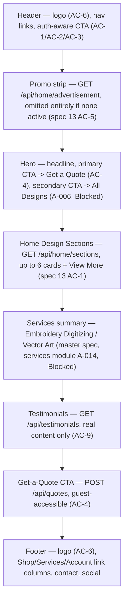
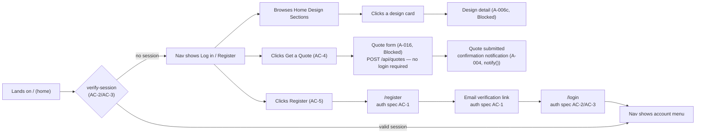

# Spec: Landing Page Experience (Home)

**File:** `docs/specs/2026-09-01-20-landing-page-experience.md`
**Status:** Approved — implemented 2026-09-05; see §0 for history
**Author:** CZ Digitizing Team
**Reviewer:** Muhammad Suleman Yaseen (Primary Admin, czdigitizing@gmail.com) — pending
**Related:** [Master platform spec](2026-08-28-cz-digitizing-platform.md),
[Authentication & Account Security](2026-08-28-01-auth-account-security.md),
[Home Page Sections & Advertisement/Offer Manager](2026-08-28-13-home-promotions-cms.md),
[Content & Knowledge Base](2026-08-28-10-content-knowledge-base.md) (testimonials),
[Smart Get a Quote](2026-08-28-11-smart-get-a-quote.md),
SRS §5 (Home Page), SRS §2 (Brand & Visual System), architecture §Notifications System

---

## 0. Status note — history

This spec composes several aspects from `docs/specs/SPEC_INDEX.md` — **A-003** (Header & Global
Navigation), **A-018**/**A-018a**/**A-018b**/**A-018c** (Home Sections, Ads, Header Media), **A-009**
(Footer), and **A-012c** (Testimonials) — into one customer-facing screen. At authoring time, this
spec's own composed aspects were all `Blocked`, ultimately on **A-001 (Brand & Visual Identity
System)**, which was `Not Started` — so this document was written as an approved-in-advance
planning artifact only, per the explicit choice to write it while marking it `Blocked`.

**2026-09-05 update:** A-001/A-002/A-003/A-012c were already `Completed` by the time this spec's
implementation was picked up; the real remaining blockers were **A-018** and **A-009**, both still
un-built. Both were implemented first (in dependency order, per `CLAUDE.md`), then this spec's own
composition — see `SPEC_INDEX.md`'s Change Log for the full implementation summary. All ten ACs
below are implemented; AC-8/AC-9 of the composed Home Promotions CMS spec (A/B testing and
personalization of section order) remain documented, deliberate stubs (no analytics/personalization
engine exists in this codebase), tracked as an open risk there, not here.

A working design exploration of this page's visual direction already exists as a private Claude
Artifact (built against the real CZ Digitizing design-system tokens — logo, color, typography — once
those were made available), referenced throughout §5 below.

---

## 1. Problem statement

**Today:** `apps/web/app/page.tsx` is a bare placeholder — a heading, one line of body copy, and an
API health check. There is no hero, no design showcase, no services summary, no testimonials, no
footer, and no visible path into registration, login, or the Get-a-Quote flow. A first-time visitor
has nothing to evaluate the business by and no clear next action.

**Who is affected:** Every prospective customer's first impression of CZ Digitizing; Admin, whose
Home Sections/Advertisement/Header Media content-management work (A-018, spec 13) has nothing to
render into until this page exists; every downstream feature (catalog, quote, checkout, account)
that depends on the home page as its primary entry point.

**Why it matters now:** SRS §5 names the home page's exact structure (promo strip → Home Design
Sections → testimonials → service highlights → Get-a-Quote CTA → footer) and SRS §2 states the brand
direction (logo, palette, typography) is non-negotiable and must render "crisply and recognizably at
every size." This page is where both requirements are first tested together.

**Success looks like:** A visitor can, from the home page alone: understand what CZ Digitizing sells,
see real design/testimonial content once Admin has published it, tell at a glance whether they're
signed in, reach registration/login/Get-a-Quote in one click, and see the approved logo and brand
palette applied consistently — matching the design system exactly, not a designer's interpretation of
it.

---

## 2. Acceptance criteria

This spec's AC's cover the landing page's own *composition and cross-cutting* concerns. Content
mechanics (creating a Home Section, running an ad, publishing a testimonial) are owned by their
source specs and are not restated here — see the `Related` links above for those.

| # | Criterion |
|---|---|
| AC-1 | **Given** a visitor with no session **When** the home page loads **Then** the header nav shows "Log in" and "Register" (per [auth spec](2026-08-28-01-auth-account-security.md) routes `/login`, `/register`), and every primary CTA (hero, Get-a-Quote section) routes to a public, unauthenticated-accessible flow |
| AC-2 | **Given** a visitor with a valid session **When** the home page loads **Then** the client calls `GET /api/auth/verify-session` ([auth spec](2026-08-28-01-auth-account-security.md) §3) and the header nav replaces "Log in"/"Register" with an account entry point (name/avatar → account menu) without a page reload |
| AC-3 | **Given** a visitor whose access token has expired but a refresh token is still valid **When** `verify-session` returns `401 UNAUTHENTICATED` **Then** the client calls `POST /api/auth/refresh-token` once before falling back to the signed-out nav state — the home page never shows a signed-in nav for a session that is actually expired (auth spec AC-7) |
| AC-4 | **Given** the "Get a Quote" hero/section CTA **When** clicked **Then** it routes to the Get-a-Quote flow without requiring login — `POST /api/quotes` is public per [Smart Get a Quote](2026-08-28-11-smart-get-a-quote.md) §3 ("optionally authenticated") — and if the visitor is signed in, the flow pre-fills their account email |
| AC-5 | **Given** the "Register"/"Log in" CTAs anywhere on the page (nav, footer) **When** clicked **Then** they route to `/register` / `/login` exactly, matching the [auth spec](2026-08-28-01-auth-account-security.md) §5 route list — no ad-hoc modal or duplicate form is introduced on the landing page itself |
| AC-6 | **Given** the CZ Digitizing logo rendered in the header and footer **When** displayed on any background **Then** the correct design-system variant is used — the light-on-navy mark on dark/navy grounds, the dark-on-white mark on light grounds — never a recolored, redrawn, or substitute mark (SRS §2, AC-26 of the master platform spec) |
| AC-7 | **Given** the page's color and type tokens **When** rendered **Then** every color used is one of the design system's documented tokens (navy-900…400, gold-700…100, slate, gray-300, white) and every heading uses the display typeface / every body and UI string uses the body typeface from the design system's typography tokens — no ad-hoc hex value or third typeface is introduced |
| AC-8 | **Given** zero published Home Sections, no active advertisement, and zero published testimonials (a fresh/empty content state per spec 13 AC-5 and the [content spec](2026-08-28-10-content-knowledge-base.md) AC-4) **When** the home page renders **Then** it still renders a complete, polished page — hero, services, Get-a-Quote CTA, footer — with no broken layout, no empty containers, and no placeholder/lorem content (spec 13 §5 "Empty" state) |
| AC-9 | **Given** a testimonial displayed on the home page **When** authored **Then** it is real, Admin-curated or moderated customer content only — the landing page must never ship with placeholder/fabricated testimonial copy live in production, per the [content spec](2026-08-28-10-content-knowledge-base.md) AC-5's content-governance rule |
| AC-10 | **Given** any interactive element (design-card flip, nav links, CTAs) **When** navigated by keyboard **Then** every interaction reachable by mouse/hover is also reachable via keyboard focus, and all animation respects `prefers-reduced-motion` |

---

## 3. API contract

This page is a composition surface — it does not introduce new routes of its own. It consumes,
client-side:

| Method | Route | Owning spec | Used for |
|---|---|---|---|
| `GET` | `/api/auth/verify-session` | [Auth](2026-08-28-01-auth-account-security.md) §3 | AC-1/AC-2/AC-3 nav state |
| `POST` | `/api/auth/refresh-token` | [Auth](2026-08-28-01-auth-account-security.md) §3 | AC-3 |
| `POST` | `/api/quotes` | [Smart Get a Quote](2026-08-28-11-smart-get-a-quote.md) §3 | AC-4 |
| `GET` | `/api/home/sections` | [Home Promotions CMS](2026-08-28-13-home-promotions-cms.md) §3 | Home Design Sections |
| `GET` | `/api/home/advertisement` | [Home Promotions CMS](2026-08-28-13-home-promotions-cms.md) §3 | Promo strip |
| `GET` | `/api/home/header-media` | [Home Promotions CMS](2026-08-28-13-home-promotions-cms.md) §3 | Hero/header banner |
| `GET` | `/api/testimonials` | [Content & Knowledge Base](2026-08-28-10-content-knowledge-base.md) §3 | Testimonials section |

No new error codes. No new DTOs — see each owning spec for its shape.

---

## 4. Data model changes

None. This spec introduces no tables. It reads exclusively from entities owned by the specs listed
in §3.

---

## 5. UI states

### 5.1 Structural breakdown

Section order is fixed by SRS §5 and is not Admin-reorderable at the top level (individual Home
Sections *within* the design-showcase block are Admin-orderable — spec 13 AC-2):

### 5.2 User flow — signed-out visitor reaching an outcome

### 5.3 States table

| State | Behaviour |
|---|---|
| **Loading** | Home Sections/testimonials render skeleton placeholders; the promo strip renders nothing until the ad-active decision resolves, to avoid a flash of an empty slot (spec 13 §5) |
| **Empty** | See AC-8 — hero, services, Get-a-Quote CTA, and footer are always present; only the promo strip and Home Design Sections/testimonials blocks omit themselves when their source has no published content |
| **Error** | A failed `home/sections`, `home/advertisement`, or `testimonials` fetch degrades that one block silently (spec 13 §5 "this is marketing content, not a workflow the customer must complete") — a failed `verify-session` call falls back to the signed-out nav state, never a broken/blank header |
| **Success** | All sections render per §5.1; nav reflects the correct auth state; countdown (if a promo is active) updates live |

**Route(s):** `/` (Home) — no new routes; consumes `/login`, `/register` (auth spec), and the
Get-a-Quote route from A-016 once it exists.

### 5.4 Brand & logo parameters (SRS §2, design-system tokens)

| Parameter | Value | Source |
|---|---|---|
| Logo — on navy/dark grounds | light-on-navy mark (design system: `logo-light.png`) | design-system logo tile "on navy grounds" |
| Logo — on white/light grounds | dark-on-white mark (design system: `logo-dark.png`) | design-system logo tile "on white/light grounds" |
| Display typeface | Playfair Display — headings, section titles only | design-system `tokens/typography.css` |
| Body/UI typeface | Montserrat — nav, body copy, buttons, labels | design-system `tokens/typography.css` |
| Color — navy ramp | `navy-900 #060B1A` … `navy-400 #334A7A` | design-system `tokens/colors.css` |
| Color — gold ramp | `gold-700 #8A6D1E` … `gold-100 #FAF1D8` | design-system `tokens/colors.css` |
| Color — neutrals | slate `#4A5568`, gray-300 `#E5E7EB`, white `#FAFAFA` | design-system `tokens/colors.css` |
| Card radius | 10px | design-system foundations |
| Button/field radius | 8px | design-system foundations |

AC-6/AC-7 exist specifically to make these parameters testable rather than descriptive-only — see
§6's Visual QA row.

---

## 6. Test plan

| Level | What it covers | Where |
|---|---|---|
| **Unit** | nav auth-state resolution (signed-out / signed-in / expired-then-refreshed), empty-state fallback logic per section | `apps/web/home/*.spec.ts` |
| **Integration** | home page server-render pulls `home/sections`, `home/advertisement`, `testimonials` correctly; a failing one of the three does not break the others | `apps/web/test/integration/home.spec.ts` |
| **Component** | design-card flip keyboard/touch fallback, reduced-motion behavior, nav CTA routing | `apps/web/home/**` (RTL) |
| **E2E** | signed-out visitor: land → verify nav state → Get a Quote → submit (no login) → confirmation; signed-out visitor: land → Register → verify email → Login → nav updates to signed-in | `e2e/home.e2e.spec.ts` |
| **Visual QA** | logo-variant-per-ground, color-token-only audit (AC-7), type-scale audit — same checklist style as the master spec's `e2e/brand-visual-qa.spec.ts` | `e2e/home-visual-qa.spec.ts` |

**Traceability:** AC-1…AC-10 → `home.e2e.spec.ts` / `home-visual-qa.spec.ts` test names matching each
AC number.

**Coverage:** ≥80% on new code, matching this spec set's convention.

**Not covered, deliberately:** Content-management correctness (creating/reordering a Home Section,
running an ad, moderating a testimonial) — owned entirely by specs 10/13's own test plans, not
duplicated here.

---

## 7. Out of scope

- Any new backend route, table, or DTO — this page is composition-only (§3, §4).
- Personalization/A-B testing of section order — owned by spec 13 AC-8/AC-9.
- The catalog, design-detail, cart, and quote-form screens themselves — each is its own aspect
  (A-006, A-016) with its own future spec; this document only defines where this page links to them.
- Admin-side Home Sections/Advertisement/Header Media authoring UI — spec 13 owns that surface.

---

## 8. Risks and open questions

| # | Risk / question | Owner | Resolution |
|---|---|---|---|
| 1 | This spec's own aspects (A-003, A-018 family, A-009, A-012c) are `Blocked` on A-001 (Brand & Visual Identity System), which is `Not Started` — nothing here can be implemented until that lands | Admin / Engineering | Open — see §0 |
| 2 | Whether the account-menu entry point (AC-2) is a dropdown on the landing page itself or a redirect to a dedicated account screen is not yet decided — depends on A-019 (Customer Account & Purchase History), also `Blocked` | Admin | Open |
| 3 | Whether the hero's secondary CTA links to the full catalog (A-006) or a specific curated Home Section is a merchandising decision, not an engineering one | Admin | Open |

---

## 9. Rollout

- **Feature flag:** none — this is the site's primary entry point, not an opt-in feature.
- **Migration order:** not applicable (§4 — no schema changes). Implementation order must still
  respect `SPEC_INDEX.md`: A-001 → A-002 (done) → A-003 → A-018 family / A-009 / A-012c → this page.
- **Rollback:** standard image rollback; no data migrations to reverse.
- **Observability:** track nav-state-resolution failures (AC-3's fallback path firing more than
  expected would indicate a refresh-token bug) and per-section fetch failure rate (AC-8's graceful
  degradation should keep the visible failure rate near zero even if one upstream API is unhealthy).
